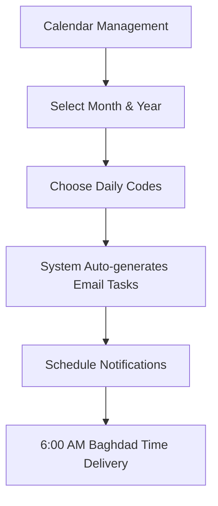

# 🏫 Sada - School Management System
**سیستەمی بەڕێوەبردنی بەردۆز - سەدا**

<div align="center">

[](https://nextjs.org/)
[](https://mongodb.com/)
[](https://reactjs.org/)
[](https://docker.com/)
[](https://github.com/bazhdarrzgar/sada)
[](LICENSE)

**🌟 A comprehensive bilingual (Kurdish/English) school management system with 17+ modules, enhanced calendar scheduling, automated email notifications, and professional video management capabilities.**

[🚀 Quick Start](#-quick-start) • [📖 Documentation](#-features) • [🐳 Docker Setup](#-docker-deployment) • [🔧 API Reference](#-api-documentation) • [🤝 Contributing](#-contributing)

</div>

---

## 📋 Table of Contents

- [✨ Features](#-features)
- [🚀 Quick Start](#-quick-start)
- [🐳 Docker Deployment](#-docker-deployment)
- [🏗️ Installation](#-installation)
- [📅 Calendar System](#-enhanced-calendar-system)
- [🎬 Video Management](#-video-management-system)
- [📧 Email Notifications](#-email-notification-system)
- [🏫 System Modules](#-system-modules)
- [🛠️ Technology Stack](#-technology-stack)
- [🔧 API Documentation](#-api-documentation)
- [📁 Project Structure](#-project-structure)
- [🧪 Testing](#-testing)
- [🚀 Deployment](#-deployment)
- [🤝 Contributing](#-contributing)
- [📄 License](#-license)

---

## ✨ Features

### 🎯 Core Capabilities
- **🌐 Bilingual Interface**: Full Kurdish (Sorani) and English support with RTL/LTR layouts
- **📱 Responsive Design**: Optimized for desktop, tablet, and mobile devices
- **🔐 Secure Authentication**: JWT-based authentication with role-based access control
- **🔍 Advanced Search**: Fuzzy search across all modules powered by Fuse.js
- **📊 Real-time Analytics**: Live data visualization and automatic calculations
- **📄 Export Systems**: Excel/PDF generation with custom templates
- **🎨 Modern UI/UX**: Built with Tailwind CSS and Radix UI components
- **⚡ Performance**: Optimized for speed with Next.js App Router and MongoDB indexing
- **🎛️ Customizable Interface**: Module-specific interface controls and customizations

### 🆕 Advanced Features
- **📅 Smart Calendar**: Enhanced scheduling with date pickers and email integration
- **🎬 Video Management**: Professional video upload, preview, and management system
- **📧 Automated Notifications**: Intelligent daily reminders with Baghdad timezone support
- **🔄 Real-time Updates**: Live data synchronization across all modules
- **📝 Rich Text Editor**: Comprehensive note-taking with Kurdish text support
- **🐳 Containerized**: Full Docker support with health checks and monitoring
- **🔒 Data Security**: Encrypted data storage and secure API endpoints
- **📈 Scalable Architecture**: Designed for multi-school deployment

---

## 🚀 Quick Start

### One-Line Setup
```bash
# 🐳 Docker (Recommended)
git clone https://github.com/bazhdarrzgar/sada.git && cd sada && docker-compose up -d

# 🛠️ Local Development
git clone https://github.com/bazhdarrzgar/sada.git && cd sada && yarn install && yarn dev
```

### Access the Application
- **🌐 Web Interface**: [http://localhost:3000](http://localhost:3000)
- **🔐 Default Login**: `berdoz` / `berdoz@code`
- **📊 Admin Panel**: Available after login
- **📖 API Documentation**: [http://localhost:3000/api-docs](http://localhost:3000/api-docs)

---

## 🐳 Docker Deployment

### Quick Deploy
```bash
# Clone repository
git clone https://github.com/bazhdarrzgar/sada.git
cd sada

# Start services
docker-compose up -d

# Verify deployment
docker-compose ps
docker-compose logs -f
```

### Production Setup
```bash
# Production environment
docker-compose -f docker-compose.prod.yml up -d

# SSL Configuration (with Nginx)
./scripts/setup-ssl.sh

# Monitoring
docker-compose logs -f --tail=100
```

### Docker Services
| Service | Port | Description |
|---------|------|-------------|
| **Next.js App** | 3000 | Main application server |
| **MongoDB** | 27017 | Database server |
| **Nginx** | 80/443 | Reverse proxy (production) |
| **Redis** | 6379 | Caching layer (optional) |

---

## 🏗️ Installation

### Prerequisites
```bash
# Required Software
Node.js >= 18.17.0
MongoDB >= 6.0.0
Yarn >= 1.22.0
Docker >= 20.10.0 (optional)
```

### Local Development Setup

#### 1. Clone & Install
```bash
# Clone repository
git clone https://github.com/bazhdarrzgar/sada.git
cd sada

# Install dependencies
yarn install

# Setup environment variables
cp .env.example .env.local
```

#### 2. Database Setup
```bash
# Option 1: Docker MongoDB
docker run -d -p 27017:27017 --name mongodb mongo:6.6.0

# Option 2: Local MongoDB
sudo systemctl start mongod

# Option 3: MongoDB Atlas (Cloud)
# Update MONGO_URL in .env.local with your Atlas connection string
```

#### 3. Development Server
```bash
# Start development server
yarn dev

# Build for production
yarn build && yarn start

# Linting and formatting
yarn lint && yarn format
```

#### 4. Seed Sample Data (Optional)
```bash
# Import demo data
node scripts/seed-database.js

# Generate test users
node scripts/create-test-users.js
```

---

## 📅 Enhanced Calendar System

### 🎯 Key Features
- **📅 Smart Date Selection**: Interactive calendar with Kurdish/English month support
- **🔽 Advanced Dropdowns**: Searchable code selection with real-time descriptions
- **📆 Bilingual Support**: Seamless Kurdish/English interface switching
- **📧 Auto Email Integration**: Automatic task creation with notification scheduling
- **🕕 Timezone Support**: Baghdad time with daylight saving adjustment
- **📊 Visual Analytics**: Calendar usage statistics and reporting

### 📋 Code System
```yaml
Record Type Codes (كۆدەكانی جۆرەكانی تۆمار):
  Academic:
    - A: Registration Records
    - E1-E3: Educational Categories
    - T: Teacher Management
  
  Administrative:
    - B: Media & Communications
    - C: HR Staff Records
    - D: Electronic Records
  
  Financial:
    - F1-F3: Financial Categories
    - P: Payroll Records
    - I: Installment Tracking

Total: 34+ predefined codes with custom extension support
```

### 🔧 Usage Workflow


---

## 🎬 Video Management System

### 🎥 Professional Video Features
- **📤 Multi-Upload**: Drag & drop support for multiple video files
- **🎬 Cinema Player**: Professional video player with custom controls
- **⚡ Smart Compression**: Automatic video optimization for web delivery
- **📱 Responsive Playback**: Adaptive streaming for all devices
- **🔒 Secure Storage**: Encrypted video storage with access control
- **📊 Analytics**: View counts, engagement metrics, and usage statistics

### 🎮 Advanced Player Controls
```javascript
// Enhanced Video Player Features
✨ Auto-hide controls (3-second timeout)
▶️ Play/Pause with keyboard shortcuts
⏮️ Skip backward/forward (10 seconds)
🔊 Volume control with mute toggle
📐 Fullscreen support with responsive scaling
📍 Interactive progress bar with click-to-seek
⏱️ Real-time duration and time display
🎨 Cinema-style dark interface with animations
```

### 🔧 Video Upload Specifications
| Feature | Specification |
|---------|---------------|
| **Max File Size** | 50MB per video |
| **Supported Formats** | MP4, WebM, AVI, MOV |
| **Upload Limit** | 3 videos per upload session |
| **Quality** | Auto-optimized for web delivery |
| **Security** | Virus scanning & content validation |

---

## 📧 Email Notification System

### ⚡ Automated Features
- **🕕 Smart Scheduling**: Daily notifications at 6:00 AM Baghdad time
- **📅 Calendar Integration**: Auto-extract tasks from calendar entries
- **📧 Rich Content**: HTML emails with embedded task descriptions
- **🌍 Timezone Handling**: Automatic daylight saving time adjustment
- **📊 Delivery Tracking**: Email delivery status and read receipts
- **🔄 Retry Logic**: Automatic retry for failed deliveries

### 🛠️ Configuration
```bash
# Email Settings (Admin Panel)
Navigation: Calendar → Advanced Email & Schedule Management

Required Settings:
├── Sender Email: Gmail with app password
├── Target Recipients: Multiple email support
├── Schedule Time: Configurable (default: 6:00 AM)
├── Template: Customizable HTML templates
├── Timezone: Baghdad (UTC+3) with DST support
└── Test Functions: Preview and test email delivery
```

### 📧 Email Template Structure
```html
<!DOCTYPE html>
<html dir="rtl" lang="ku">
<head>
    <meta charset="UTF-8">
    <title>Daily Tasks - تاسکەکانی ڕۆژانە</title>
</head>
<body>
    <h1>🏫 Berdoz Management System</h1>
    <h2>📅 Tasks for {{date}}</h2>
    <ul>
        {{#tasks}}
        <li><strong>{{code}}</strong>: {{description}}</li>
        {{/tasks}}
    </ul>
</body>
</html>
```

---

## 🏫 System Modules

### 📚 Academic Management
| Module | Kurdish | Features |
|--------|---------|----------|
| **Calendar Management** | بەڕێوەبردنی ساڵنامە | Enhanced scheduling, email integration, video upload |
| **Teacher Records** | تۆماری مامۆستایان | Complete profiles, health tracking, performance metrics |
| **Teacher Information** | زانیاری مامۆستایان | Subject assignments, class schedules, contact details |
| **Exam Supervision** | سەرپەرەشتی تاقیکردنەوە | Examination monitoring (grades 1-9), results tracking |
| **Activities Management** | بەڕێوەبردنی چالاکی | School events, extracurricular planning, video documentation |

### 👥 Staff & Student Management
| Module | Kurdish | Features |
|--------|---------|----------|
| **Staff Records** | تۆمارەکانی ستاف | Complete HR management, payroll integration |
| **Supervised Students** | سەرپەرەشتی خوێندکاران | Student monitoring, violation tracking, parent communication |
| **Student Permissions** | مۆڵەتی خوێندکاران | Leave management, approval workflow, notification system |
| **Employee Leaves** | مۆڵەتی کارمەندان | Staff leave tracking, substitute management |
| **Bus Management** | بەڕێوەبردنی پاس | Transportation scheduling, driver management, route optimization |

### 💰 Financial Management
| Module | Kurdish | Features |
|--------|---------|----------|
| **Payroll Management** | بەڕێوەبردنی موچە | Salary processing, tax calculations, bank integration |
| **Annual Installments** | قیستی ساڵانە | Fee collection, payment tracking, automated reminders |
| **Daily Accounts** | حساباتی ڕۆژانە | Transaction logging, financial reporting, audit trails |
| **Monthly Expenses** | خەرجی مانگانە | Budget management, expense categorization, approval workflows |
| **Building Expenses** | مەسروفی بینا | Infrastructure costs, maintenance tracking, vendor management |
| **Kitchen Expenses** | خەرجی خواردنگە | Food service management, inventory tracking, nutritional planning |

### 🔍 Utility & Search
| Module | Kurdish | Features |
|--------|---------|----------|
| **General Search** | گەڕانی گشتی | Cross-module fuzzy search, advanced filters, export results |

---

## 🛠️ Technology Stack

### Frontend Technologies
```yaml
Framework: Next.js 14.2.3 (App Router)
UI Library: React 18
Styling: 
  - Tailwind CSS 3.4.1
  - Radix UI Components
  - Custom CSS Modules

State Management:
  - React Hook State
  - Context API
  - Local Storage Persistence

Utilities:
  - Fuse.js (Advanced Search)
  - Lucide React (Icons)
  - Date-fns (Date Manipulation)
  - React Hook Form (Forms)
  - Recharts (Data Visualization)
```

### Backend Technologies
```yaml
Runtime: Node.js 18+
Database: MongoDB 6.6.0
ODM: Native MongoDB Driver
Authentication: JWT + Session Storage
File Upload: Multer + Custom Validation

Email Service:
  - Nodemailer
  - Gmail SMTP
  - HTML Templates

Scheduling:
  - Node-cron
  - Timezone Support (Baghdad UTC+3)
```

### DevOps & Infrastructure
```yaml
Containerization: Docker + Docker Compose
Deployment: 
  - Production: Docker Swarm / Kubernetes
  - Development: Local Docker
  - CI/CD: GitHub Actions

Monitoring:
  - Health Checks
  - Log Aggregation
  - Performance Metrics

Security:
  - Environment Variables
  - Input Validation
  - SQL Injection Prevention
  - XSS Protection
```

---

## 🔧 API Documentation

### Authentication
```http
POST /api/auth/login
Content-Type: application/json

{
  "username": "berdoz",
  "password": "berdoz@code"
}

Response:
{
  "success": true,
  "user": { "username": "berdoz", "role": "admin" },
  "token": "jwt_token_here"
}
```

### Calendar Management
```http
# Get Calendar Entries
GET /api/calendar
Query: ?month=June&year=2024

# Create Calendar Entry
POST /api/calendar
Content-Type: application/json

{
  "month": "June",
  "year": 2024,
  "week1": ["A", "B", "", "C"],
  "week2": ["", "A", "B", ""],
  "week3": ["C", "", "A", "B"],
  "week4": ["", "B", "", "A"]
}
```

### Video Management
```http
# Upload Video
POST /api/upload
Content-Type: multipart/form-data

file: [video_file]
folder: "driver_videos"

Response:
{
  "success": true,
  "url": "/uploads/driver_videos/video_123.mp4",
  "filename": "video_123.mp4",
  "size": 15728640
}
```

### Email Notifications
```http
# Get Daily Tasks
GET /api/daily-notifications
Query: ?date=2024-06-15

# Send Test Email
POST /api/send-test-email
Content-Type: application/json

{
  "recipient": "test@example.com",
  "template": "daily_tasks",
  "data": { "date": "2024-06-15", "tasks": [...] }
}
```

---

## 📁 Project Structure

```
sada/
├── 📁 app/                    # Next.js App Router
│   ├── 📁 api/               # API Routes
│   │   ├── 📁 calendar/      # Calendar endpoints
│   │   ├── 📁 auth/          # Authentication
│   │   ├── 📁 upload/        # File uploads
│   │   └── 📁 email-tasks/   # Email management
│   ├── 📁 [modules]/         # Dynamic module pages
│   ├── 📄 page.js           # Dashboard homepage
│   ├── 📄 layout.js         # Root layout
│   └── 📄 globals.css       # Global styles
├── 📁 components/            # React Components
│   ├── 📁 ui/               # Reusable UI components
│   │   ├── 📄 video-upload.jsx # Enhanced video player
│   │   ├── 📄 enhanced-table.jsx # Data tables
│   │   └── 📄 calendar.jsx   # Calendar components
│   ├── 📁 auth/             # Authentication components
│   ├── 📁 layout/           # Layout components
│   └── 📄 AdvancedAdminControls.js # Admin panel
├── 📁 lib/                  # Utility Libraries
│   ├── 📄 mongodb.js        # Database connection
│   ├── 📄 emailService.js   # Email utilities
│   └── 📄 utils.js          # Helper functions
├── 📁 public/               # Static Assets
│   ├── 📁 uploads/          # User uploaded files
│   └── 📁 icons/            # Application icons
├── 📁 scripts/              # Utility Scripts
│   ├── 📄 seed-database.js  # Sample data
│   └── 📄 backup-db.js      # Database backup
├── 📁 demo_data/            # Demo & Test Data
├── 📄 docker-compose.yml    # Docker configuration
├── 📄 Dockerfile           # Container definition
├── 📄 package.json         # Dependencies
├── 📄 tailwind.config.js   # Styling configuration
├── 📄 next.config.js       # Next.js configuration
└── 📄 README.md            # This file
```

---

## 🧪 Testing

### Running Tests
```bash
# Unit Tests
yarn test

# Integration Tests
yarn test:integration

# E2E Tests
yarn test:e2e

# Test Coverage
yarn test:coverage
```

### Test Environment Setup
```bash
# Setup test database
docker run -d -p 27018:27017 --name test-mongodb mongo:6.6.0

# Run tests with test database
MONGO_URL=mongodb://localhost:27018/sada_test yarn test
```

### Manual Testing Checklist
- [ ] User authentication (login/logout)
- [ ] Calendar entry creation and editing
- [ ] Video upload and playback
- [ ] Email notification scheduling
- [ ] Module navigation and search
- [ ] Data export functionality
- [ ] Responsive design on mobile/tablet
- [ ] Kurdish/English language switching

---

## 🚀 Deployment

### Production Environment
```bash
# Build production image
docker build -t sada-production .

# Deploy with Docker Compose
docker-compose -f docker-compose.prod.yml up -d

# Environment variables
cp .env.production.example .env.production
# Edit .env.production with your settings
```

### Environment Variables
```bash
# Database
MONGO_URL=mongodb://localhost:27017/sada
DB_NAME=sada

# Authentication
JWT_SECRET=your-super-secret-jwt-key
SESSION_SECRET=your-session-secret

# Email Configuration
EMAIL_HOST=smtp.gmail.com
EMAIL_PORT=587
EMAIL_USER=your-email@gmail.com
EMAIL_PASS=your-app-password

# File Upload
UPLOAD_DIR=./public/uploads
MAX_FILE_SIZE=50MB

# Application
NODE_ENV=production
PORT=3000
```

### SSL Setup (Nginx)
```nginx
server {
    listen 443 ssl http2;
    server_name your-domain.com;
    
    ssl_certificate /path/to/certificate.crt;
    ssl_certificate_key /path/to/private.key;
    
    location / {
        proxy_pass http://localhost:3000;
        proxy_set_header Host $host;
        proxy_set_header X-Real-IP $remote_addr;
    }
}
```

---

## 🤝 Contributing

We welcome contributions to the Sada School Management System! Please follow these guidelines:

### Development Workflow
1. **Fork** the repository
2. **Create** a feature branch (`git checkout -b feature/amazing-feature`)
3. **Commit** your changes (`git commit -m 'Add amazing feature'`)
4. **Push** to the branch (`git push origin feature/amazing-feature`)
5. **Open** a Pull Request

### Contribution Guidelines
- Follow the existing code style and conventions
- Write clear, concise commit messages
- Include tests for new features
- Update documentation for API changes
- Ensure all tests pass before submitting PR

### Code Style
```bash
# Linting
yarn lint

# Formatting
yarn format

# Type checking
yarn type-check
```

### Issue Reporting
When reporting issues, please include:
- Operating System and version
- Node.js and MongoDB versions
- Steps to reproduce the issue
- Expected vs actual behavior
- Screenshots (if applicable)

---

## 📄 License

This project is licensed under the MIT License - see the [LICENSE](LICENSE) file for details.

---

## 📞 Support & Contact

- **📧 Email**: [support@sada-system.com](mailto:support@sada-system.com)
- **🐛 Issues**: [GitHub Issues](https://github.com/bazhdarrzgar/sada/issues)
- **📖 Documentation**: [Wiki](https://github.com/bazhdarrzgar/sada/wiki)
- **💬 Discussions**: [GitHub Discussions](https://github.com/bazhdarrzgar/sada/discussions)

---

## 🙏 Acknowledgments

- **Kurdish Language Support**: Special thanks to the Kurdish tech community
- **Open Source Libraries**: Built on the shoulders of amazing open source projects
- **Educational Institutions**: Inspired by real-world school management needs
- **Contributors**: Thank you to all contributors who help improve this system

---

<div align="center">

**Built with ❤️ for Kurdish Educational Institutions**

**ساداکراو لەگەڵ خۆشەویستی بۆ دامەزراوە پەروەردەییەکانی کورد**

[⬆ Back to Top](#-sada---school-management-system)

</div>