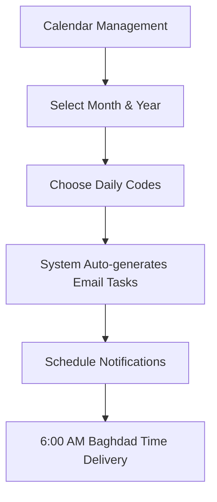

# 🏫 Sada - Advanced School Management System
**سیستەمی بەڕێوبردنی بیردۆز - سەدا**

<div align="center">

[](https://nextjs.org/)
[](https://mongodb.com/)
[](https://reactjs.org/)
[](https://docker.com/)
[](https://github.com/bazhdarrzgar/sada)
[](https://github.com/bazhdarrzgar/sada)
[](LICENSE)

**🌟 A comprehensive bilingual (Kurdish/English) school management system with 23+ modules, enhanced calendar scheduling, automated email notifications, professional video management, Docker-optimized file uploads, and intelligent port management.**

[🚀 Quick Start](#-quick-start) • [📋 Features](#-features) • [🐳 Docker Setup](#-docker-deployment) • [📤 Upload Fixes](#-file-upload-system) • [🔧 Troubleshooting](#-troubleshooting) • [🤝 Contributing](#-contributing)

</div>

## 🔧 Recent Updates & Customizations

### ⚙️ Interface Improvements (Latest)
- **⚡ Smart Port Configuration**: Intelligent port detection with automatic fallback (3000 → 3001 → 3002...)
- **🎛️ Module-Specific Controls**: Streamlined interface controls for specific modules
- **📊 Enhanced Daily Accounts**: Improved weekly summaries and filtering capabilities  
- **🍽️ Kitchen Expenses**: Optimized expense tracking with better categorization
- **👁️ Supervision System**: Enhanced monitoring and reporting features
- **🚀 Performance**: Reduced UI clutter and improved loading speeds
- **⚡ Page Preloading**: Automatic compilation of all pages in dev mode for instant navigation

### 🎨 UI/UX Enhancements
- **📱 Mobile Optimization**: Better responsive design for all screen sizes
- **🌗 Dark Mode**: Enhanced dark theme support across all modules
- **⚡ Fast Loading**: Optimized component loading and rendering
- **🎯 Focused Interface**: Clean, distraction-free user experience
- **🔥 Dev Experience**: Pre-compiled pages eliminate compilation delays during development

### 📤 File Upload System Enhancement
- **🐳 Docker-Optimized Uploads**: Fixed permission issues for container environments
- **🛡️ Enhanced Error Handling**: Improved upload API with Docker-specific error management
- **⚙️ Production Ready**: Optimized Docker Compose with named volumes and correct permissions
- **🚀 Startup Scripts**: Automated permissions setup for seamless file operations

## 🚀 Production VPS Deployment

### 🎉 Complete Production Package Ready!
Production-ready deployment solution for 1GB RAM Ubuntu VPS with comprehensive automation.

#### 📁 Deployment Files:
- **pre-deployment-check.sh** - System readiness verification (11 critical checks)
- **deploy-sada-production.sh** - Complete production setup (60+ packages)
- **quick-deploy.sh** - Fast basic setup with essentials
- **PRODUCTION_DEPLOYMENT.md** - Step-by-step deployment guide

#### 🚀 One-Command VPS Setup:
```bash
# Complete Production Setup (Recommended)
wget https://raw.githubusercontent.com/bazhdarrzgar/sada/main/deploy-sada-production.sh
chmod +x deploy-sada-production.sh
./deploy-sada-production.sh

# Quick Setup
wget https://raw.githubusercontent.com/bazhdarrzgar/sada/main/quick-deploy.sh
chmod +x quick-deploy.sh
./quick-deploy.sh
```

#### ✅ Auto-Installed Features:
- **System**: Docker, Node.js, MongoDB, Nginx, SSL certificates
- **Security**: UFW firewall, fail2ban, intrusion prevention
- **Optimization**: 1GB swap, memory limits, performance tuning
- **Monitoring**: Automated backups, health checks, log rotation

#### 🌐 Access After Deployment:
- **Direct**: `http://your-vps-ip:3000`
- **With SSL**: `https://your-domain.com`
- **Memory Usage**: ~800MB total (optimized for 1GB RAM VPS)

---

## 🔧 Troubleshooting

### 📤 File Upload Issues (Most Common)

#### Quick Diagnosis
```bash
# Run comprehensive diagnosis
./diagnose-upload-issue.sh

# Check container status
docker-compose ps

# View upload API logs
docker-compose logs app | grep -i upload
```

#### Common Upload Problems

| Issue | Symptoms | Solution |
|-------|----------|----------|
| **Permission Denied** | `EACCES: permission denied` | `./fix-upload-permissions.sh` |
| **Directory Missing** | `ENOENT: no such file` | `mkdir -p ./public/upload && ./fix-upload-permissions.sh` |
| **Container Not Ready** | Connection refused | Wait 30s, check `docker-compose ps` |
| **File Too Large** | Upload fails silently | Check limits: 5MB (images), 50MB (videos) |
| **Wrong File Type** | Validation error | Use: PNG, JPG, GIF, WebP, MP4, WebM, AVI, MOV |

#### Upload Recovery Steps
```bash
# 1. Stop containers
docker-compose down

# 2. Fix permissions
./fix-upload-permissions.sh

# 3. Restart with build
docker-compose up --build -d

# 4. Test upload
./diagnose-upload-issue.sh
```

### 🐳 Docker Issues

#### Container Problems
```bash
# Check all services
docker-compose ps

# View detailed logs
docker-compose logs -f app
docker-compose logs -f mongodb

# Restart specific service
docker-compose restart app

# Complete reset (removes all data)
docker-compose down -v
docker-compose up --build
```

#### Port Conflicts
```bash
# Use smart port detection
yarn dev:smart

# Check what's using port 3000
lsof -i :3000

# Kill process on port 3000
pkill -f "3000"
```

### 💾 Database Issues

#### MongoDB Connection
```bash
# Check MongoDB status
docker-compose ps mongodb

# View MongoDB logs  
docker-compose logs mongodb

# Test connection
docker-compose exec mongodb mongosh --eval "db.runCommand('ping')"

# Restart MongoDB only
docker-compose restart mongodb
```

### ⚡ Performance Issues

#### Memory Problems
```bash
# Check container memory usage
docker stats

# Reduce Node.js memory limit
NODE_OPTIONS='--max-old-space-size=1024' yarn dev

# Clean Docker system
docker system prune -a
```

#### Slow Startup
```bash
# Use preloaded development
yarn dev:preload

# Check resource constraints
docker system df

# Clear Next.js cache
rm -rf .next
yarn dev
```

### 🆘 Getting Help

If issues persist after trying the above solutions:

1. **📋 Collect Information**:
   ```bash
   # System info
   docker version && docker-compose version
   node --version && yarn --version
   
   # Service status
   docker-compose ps
   
   # Recent logs
   docker-compose logs --tail=50 app
   ```

2. **🔍 Run Diagnostics**:
   ```bash
   ./diagnose-upload-issue.sh > diagnosis.log
   ```

3. **📧 Report Issue**: Include the above information when reporting issues

---

## 📋 Table of Contents

- [🚀 Quick Start](#-quick-start)
- [📋 Features](#-features)
- [🐳 Docker Deployment](#-docker-deployment)
- [📤 File Upload System](#-file-upload-system)
- [⚡ Smart Port Management](#-smart-port-management)
- [🔧 Troubleshooting](#-troubleshooting)
- [🏗️ Installation](#-installation)
- [📅 Calendar System](#-enhanced-calendar-system)
- [🎬 Video Management](#-video-management-system)
- [📧 Email Notifications](#-email-notification-system)
- [🏫 System Modules](#-system-modules)
- [🛠️ Technology Stack](#-technology-stack)
- [🔧 API Documentation](#-api-documentation)
- [📁 Project Structure](#-project-structure)
- [🧪 Testing](#-testing)
- [🚀 Deployment](#-deployment)
- [🤝 Contributing](#-contributing)
- [📄 License](#-license)

---

## 📋 Features

### 🎯 Core System Capabilities
- **🌐 Bilingual Interface**: Complete Kurdish (Sorani) and English support with RTL/LTR layouts
- **📱 Responsive Design**: Optimized for desktop, tablet, and mobile devices
- **🔐 Secure Authentication**: JWT-based authentication with role-based access control
- **🔍 Advanced Search**: Fuzzy search across all modules powered by Fuse.js
- **📊 Real-time Analytics**: Live data visualization with automatic calculations
- **📄 Export Systems**: Excel/PDF generation with custom templates
- **🎨 Modern UI/UX**: Built with Tailwind CSS and Radix UI components
- **⚡ High Performance**: Optimized with Next.js App Router and MongoDB indexing

### 🆕 Advanced Features
- **📤 Docker-Optimized File Uploads**: Fixed permission issues with comprehensive error handling
- **📅 Smart Calendar System**: Enhanced scheduling with email integration and timezone support
- **🎬 Professional Video Management**: Upload, preview, and management with cinema-style player
- **📧 Automated Email Notifications**: Intelligent daily reminders with Baghdad timezone support
- **⚡ Smart Port Detection**: Automatic port conflict resolution (3000 → 3001 → 3002...)
- **🔄 Real-time Data Sync**: Live updates across all modules and components
- **📝 Rich Text Editor**: Comprehensive note-taking with full Kurdish text support
- **🔒 Enterprise Security**: Encrypted data storage and secure API endpoints
- **📈 Scalable Architecture**: Multi-school deployment ready
- **⚡ Page Preloading**: Automatic compilation of 23+ pages for instant navigation

### 🛠️ Technical Enhancements
- **🐳 Container-Ready**: Full Docker support with health checks and volume management
- **🔧 Permission Management**: Automated upload directory permission fixes
- **📊 Comprehensive Logging**: Detailed error tracking and debugging information
- **🧪 Testing Suite**: Upload testing scripts and diagnostic tools
- **📚 Documentation**: Complete setup guides and troubleshooting documentation

---

## 🚀 Quick Start

### ⚡ One-Command Setup

Choose your preferred method to get started:

```bash
# 🐳 Docker (Recommended for Production)
git clone https://github.com/bazhdarrzgar/sada.git && cd sada && ./docker-setup-with-permissions.sh

# 🛠️ Local Development with Smart Port Detection
git clone https://github.com/bazhdarrzgar/sada.git && cd sada && yarn install && yarn dev:smart

# ⚡ Local Development with Page Preloading
git clone https://github.com/bazhdarrzgar/sada.git && cd sada && yarn install && yarn dev:preload
```

### 🌐 Access Points

| Service | URL | Credentials |
|---------|-----|-------------|
| **Main Application** | [http://localhost:3000](http://localhost:3000) | `berdoz` / `berdoz@code` |
| **MongoDB** | `localhost:27017` | No authentication |
| **File Uploads** | `/api/upload` | Automatic handling |

### ✅ Quick Verification

```bash
# Check if services are running
docker-compose ps

# Test file upload functionality
./diagnose-upload-issue.sh

# View application logs
docker-compose logs -f app
```

---

## ⚡ Smart Port Management

### 🎯 Intelligent Port Detection System

Sada features **automatic port detection** that prevents conflicts and ensures smooth development:

#### 🛠️ Development Scripts

| Script | Port Behavior | Use Case |
|--------|---------------|----------|
| `yarn dev:smart` | Auto-detects (3000→3001→3002...) | **Recommended for development** |
| `yarn dev` | Fixed port 3000 | May fail if port busy |
| `yarn dev:preload` | Port 3000 + page preloading | Enhanced development experience |

#### 📊 Port Priority System

```
Primary: 3000 → Fallback: 3001 → 3002 → 3003 → ... → 3009
```

#### ✨ Smart Port Benefits

- ✅ **Zero Conflicts**: Automatically finds available ports
- ✅ **Clear Messaging**: Shows exactly which port is being used
- ✅ **Docker Compatible**: Works seamlessly with containers
- ✅ **Developer Friendly**: No manual port management needed

#### 🚀 Usage Examples

```bash
# Recommended: Smart port detection
yarn dev:smart
# Output: 🚀 Server ready on http://localhost:3001

# Docker with fixed port
docker-compose up -d
# Always uses port 3000 (Docker handles conflicts)

# With page preloading
yarn dev:preload
```

---

## 🐳 Docker Deployment

### 🚀 Quick Deploy with Upload Fixes

Our Docker setup includes **automatic permission fixes** for file uploads:

```bash
# Clone repository
git clone https://github.com/bazhdarrzgar/sada.git
cd sada

# Automated setup with upload fixes (Recommended)
./docker-setup-with-permissions.sh

# Manual setup (if automated fails)
./fix-upload-permissions.sh
docker-compose up -d
```

### 📊 Service Status

| Service | Port | Status Check | Upload Support |
|---------|------|--------------|----------------|
| **Next.js App** | 3000 | `docker-compose ps app` | ✅ Images/Videos |
| **MongoDB** | 27017 | `docker-compose logs mongodb` | ✅ Metadata storage |
| **Upload Volume** | - | `ls -la ./public/upload/` | ✅ Persistent storage |

### 🔧 Docker Scripts

| Script | Purpose | Usage |
|--------|---------|-------|
| `docker-setup-with-permissions.sh` | Complete setup with upload fixes | `./docker-setup-with-permissions.sh` |
| `fix-upload-permissions.sh` | Fix upload permissions only | `./fix-upload-permissions.sh` |
| `diagnose-upload-issue.sh` | Diagnose upload problems | `./diagnose-upload-issue.sh` |

---

## 📤 File Upload System

### 🔧 Docker Upload Fixes

The system includes **comprehensive fixes** for Docker upload permission issues:

#### ✅ What's Fixed
- **Permission Errors**: `EACCES: permission denied` errors resolved
- **Container User Mismatch**: Proper ownership (1001:1001) for nextjs user
- **Volume Permissions**: Correct Docker volume configuration
- **Directory Creation**: Automatic upload directory structure

#### 🛠️ Upload Features
| Feature | Specification | Status |
|---------|---------------|--------|
| **Image Upload** | PNG, JPG, GIF, WebP (Max: 5MB) | ✅ Working |
| **Video Upload** | MP4, WebM, AVI, MOV (Max: 50MB) | ✅ Working |
| **Permission Handling** | Automatic Docker fixes | ✅ Fixed |
| **Error Recovery** | Detailed error messages | ✅ Enhanced |
| **Volume Management** | Persistent named volumes | ✅ Optimized |

#### 🧪 Testing Upload Functionality

```bash
# Quick diagnosis
./diagnose-upload-issue.sh

# Comprehensive upload test
curl -X POST http://localhost:3000/api/upload \
  -F "file=@your-image.png" \
  -F "folder=test"

# Expected successful response:
{
  "success": true,
  "url": "/upload/test/abc123.png",
  "filename": "abc123.png",
  "size": 1024000
}
```

#### 📁 Upload Directory Structure

```
./public/upload/
├── uploads/           # General uploads
├── images/            # Image uploads  
├── videos/            # Video uploads
├── Image_Activity/    # Activity photos
├── Image_Psl/         # License images
├── driver_videos/     # Driver training videos
├── license_images/    # License documents
└── test/              # Test uploads
```

#### 🚨 Troubleshooting Upload Issues

| Error | Cause | Solution |
|-------|-------|----------|
| `Permission denied` | Wrong ownership | Run `./fix-upload-permissions.sh` |
| `Directory not found` | Missing folders | Run `./docker-setup-with-permissions.sh` |
| `Container not ready` | Service starting | Wait 30 seconds, check `docker-compose ps` |
| `File too large` | Size limit exceeded | Check file size limits (5MB images, 50MB videos) |

#### 📖 Detailed Documentation

For comprehensive upload troubleshooting, see:
- **[UPLOAD_PERMISSIONS_FIX.md](./UPLOAD_PERMISSIONS_FIX.md)** - Complete fix guide
- **Upload API logs**: `docker-compose logs app | grep upload`

---

### 📤 Docker Upload System
The enhanced Docker setup includes automatic fixes for file upload permissions and comprehensive error handling.

#### **Pages with Upload Functionality**
- **Video Demo**: `/video-demo` - Image and video uploads with professional player
- **Bus Management**: `/bus` - Driver photos and training videos
- **Daily Accounts**: `/daily-accounts` - Receipt image uploads  
- **Expenses**: `/expenses` - Expense receipt documentation
- **Activities**: `/activities` - Event photos and videos
- **Teachers**: `/teachers` - Profile image management
- **Kitchen Expenses**: `/kitchen-expenses` - Food service receipts

### 🛠️ Enhanced Docker Scripts

The project includes improved Docker setup scripts with upload testing:

```bash
# Automated Docker setup with upload testing
./docker-setup.sh

# Test upload functionality only  
./docker-setup.sh --test

# Comprehensive upload testing
./docker-upload-test.sh

# Show container status
./docker-setup.sh --status

# View container logs
./docker-setup.sh --logs
```

### Production Setup
```bash
# Production environment  
docker-compose -f docker-compose.prod.yml up -d

# Test upload functionality
./docker-upload-test.sh

# SSL Configuration (with Nginx)  
./scripts/setup-ssl.sh

# Monitoring
docker-compose logs -f --tail=100
```

### Docker Services
| Service | Port | Description | Upload Support |
|---------|------|-------------|----------------|
| **Next.js App** | 3000 | Main application server | ✅ Image/Video uploads |
| **MongoDB** | 27017 | Database server | ✅ File metadata storage |
| **Nginx** | 80/443 | Reverse proxy (production) | ✅ Static file serving |
| **Redis** | 6379 | Caching layer (optional) | - |

---

## 🏗️ Installation

### Prerequisites
```bash
# Required Software
Node.js >= 18.17.0
MongoDB >= 6.0.0
Yarn >= 1.22.0
Docker >= 20.10.0 (optional)
```

### Local Development Setup

#### 1. Clone & Install
```bash
# Clone repository
git clone https://github.com/bazhdarrzgar/sada.git
cd sada

# Install dependencies
yarn install

# Setup environment variables
cp .env.example .env.local
```

#### 2. Database Setup
```bash
# Option 1: Docker MongoDB
docker run -d -p 27017:27017 --name mongodb mongo:6.6.0

# Option 2: Local MongoDB
sudo systemctl start mongod

# Option 3: MongoDB Atlas (Cloud)
# Update MONGO_URL in .env.local with your Atlas connection string
```

#### 3. Development Server
```bash
# Start development server (regular)
yarn dev

# Start development server with page preloading (recommended)
yarn dev:preload

# Preload existing server only
yarn preload-only

# Build for production
yarn build && yarn start

# Linting and formatting
yarn lint && yarn format
```

#### 🚀 Page Preloading System (New!)
The system now includes automatic page preloading for faster development:

```bash
# Development with automatic page preloading
yarn dev:preload
# ✅ Starts Next.js server
# ✅ Waits for server ready
# ✅ Automatically compiles all 23+ pages
# ✅ Eliminates compilation delays

# Alternative methods
yarn dev:preload-simple     # Simple preloading approach
yarn preload-only          # Preload existing server
```

**🎯 Benefits:**
- **Instant Navigation**: No compilation delays when switching pages
- **Better Dev Experience**: All components pre-compiled
- **Time Saving**: Eliminates manual page visits
- **Complete Coverage**: All routes automatically preloaded

For more details, see [PRELOADING.md](./PRELOADING.md)

#### 4. Seed Sample Data (Optional)
```bash
# Import demo data
node scripts/seed-database.js

# Generate test users
node scripts/create-test-users.js
```

---

## 📅 Enhanced Calendar System

### 🎯 Key Features
- **📅 Smart Date Selection**: Interactive calendar with Kurdish/English month support
- **🔽 Advanced Dropdowns**: Searchable code selection with real-time descriptions
- **📆 Bilingual Support**: Seamless Kurdish/English interface switching
- **📧 Auto Email Integration**: Automatic task creation with notification scheduling
- **🕕 Timezone Support**: Baghdad time with daylight saving adjustment
- **📊 Visual Analytics**: Calendar usage statistics and reporting

### 📋 Code System
```yaml
Record Type Codes (كۆدەكانی جۆرەكانی تۆمار):
  Academic:
    - A: Registration Records
    - E1-E3: Educational Categories
    - T: Teacher Management
  
  Administrative:
    - B: Media & Communications
    - C: HR Staff Records
    - D: Electronic Records
  
  Financial:
    - F1-F3: Financial Categories
    - P: Payroll Records
    - I: Installment Tracking

Total: 34+ predefined codes with custom extension support
```

### 🔧 Usage Workflow


---

## 🎬 Video Management System

### 🎥 Professional Video Features
- **📤 Multi-Upload**: Drag & drop support for multiple video files
- **🎬 Cinema Player**: Professional video player with custom controls
- **⚡ Smart Compression**: Automatic video optimization for web delivery
- **📱 Responsive Playback**: Adaptive streaming for all devices
- **🔒 Secure Storage**: Encrypted video storage with access control
- **📊 Analytics**: View counts, engagement metrics, and usage statistics

### 🎮 Advanced Player Controls
```javascript
// Enhanced Video Player Features
✨ Auto-hide controls (3-second timeout)
▶️ Play/Pause with keyboard shortcuts
⏮️ Skip backward/forward (10 seconds)
🔊 Volume control with mute toggle
📐 Fullscreen support with responsive scaling
📍 Interactive progress bar with click-to-seek
⏱️ Real-time duration and time display
🎨 Cinema-style dark interface with animations
```

### 🔧 Video Upload Specifications
| Feature | Specification |
|---------|---------------|
| **Max File Size** | 50MB per video |
| **Supported Formats** | MP4, WebM, AVI, MOV |
| **Upload Limit** | 3 videos per upload session |
| **Quality** | Auto-optimized for web delivery |
| **Security** | Virus scanning & content validation |

---

## 📧 Email Notification System

### ⚡ Automated Features
- **🕕 Smart Scheduling**: Daily notifications at 6:00 AM Baghdad time
- **📅 Calendar Integration**: Auto-extract tasks from calendar entries
- **📧 Rich Content**: HTML emails with embedded task descriptions
- **🌍 Timezone Handling**: Automatic daylight saving time adjustment
- **📊 Delivery Tracking**: Email delivery status and read receipts
- **🔄 Retry Logic**: Automatic retry for failed deliveries

### 🛠️ Configuration
```bash
# Email Settings (Admin Panel)
Navigation: Calendar → Advanced Email & Schedule Management

Required Settings:
├── Sender Email: Gmail with app password
├── Target Recipients: Multiple email support
├── Schedule Time: Configurable (default: 6:00 AM)
├── Template: Customizable HTML templates
├── Timezone: Baghdad (UTC+3) with DST support
└── Test Functions: Preview and test email delivery
```

### 📧 Email Template Structure
```html
<!DOCTYPE html>
<html dir="rtl" lang="ku">
<head>
    <meta charset="UTF-8">
    <title>Daily Tasks - تاسکەکانی ڕۆژانە</title>
</head>
<body>
    <h1>🏫 Berdoz Management System</h1>
    <h2>📅 Tasks for {{date}}</h2>
    <ul>
        {{#tasks}}
        <li><strong>{{code}}</strong>: {{description}}</li>
        {{/tasks}}
    </ul>
</body>
</html>
```

---

## 🏫 System Modules

### 📚 Academic Management
| Module | Kurdish | Features |
|--------|---------|----------|
| **Calendar Management** | بەڕێوەبردنی ساڵنامە | Enhanced scheduling, email integration, video upload |
| **Teacher Records** | تۆماری مامۆستایان | Complete profiles, health tracking, performance metrics |
| **Teacher Information** | زانیاری مامۆستایان | Subject assignments, class schedules, contact details |
| **Exam Supervision** | سەرپەرەشتی تاقیکردنەوە | Examination monitoring (grades 1-9), results tracking |
| **Activities Management** | بەڕێوەبردنی چالاکی | School events, extracurricular planning, video documentation |

### 👥 Staff & Student Management
| Module | Kurdish | Features |
|--------|---------|----------|
| **Staff Records** | تۆمارەکانی ستاف | Complete HR management, payroll integration |
| **Supervised Students** | سەرپەرەشتی خوێندکاران | Student monitoring, violation tracking, parent communication |
| **Student Permissions** | مۆڵەتی خوێندکاران | Leave management, approval workflow, notification system |
| **Employee Leaves** | مۆڵەتی کارمەندان | Staff leave tracking, substitute management |
| **Bus Management** | بەڕێوەبردنی پاس | Transportation scheduling, driver management, route optimization |

### 💰 Financial Management
| Module | Kurdish | Features |
|--------|---------|----------|
| **Payroll Management** | بەڕێوەبردنی موچە | Salary processing, tax calculations, bank integration |
| **Annual Installments** | قیستی ساڵانە | Fee collection, payment tracking, automated reminders |
| **Daily Accounts** | حساباتی ڕۆژانە | Transaction logging, financial reporting, audit trails, weekly summaries |
| **Monthly Expenses** | خەرجی مانگانە | Budget management, expense categorization, approval workflows |
| **Building Expenses** | مەسروفی بینا | Infrastructure costs, maintenance tracking, vendor management |
| **Kitchen Expenses** | خەرجی خواردنگە | Food service management, inventory tracking, nutritional planning |

### 🛡️ Supervision & Security
| Module | Kurdish | Features |
|--------|---------|----------|
| **Supervision System** | سیستەمی چاودێری | Teacher and student supervision, violation tracking, punishment records |

### 🔍 Utility & Search
| Module | Kurdish | Features |
|--------|---------|----------|
| **General Search** | گەڕانی گشتی | Cross-module fuzzy search, advanced filters, export results |

---

## 🛠️ Technology Stack

### Frontend Technologies
```yaml
Framework: Next.js 14.2.3 (App Router)
UI Library: React 18
Styling: 
  - Tailwind CSS 3.4.1
  - Radix UI Components
  - Custom CSS Modules

State Management:
  - React Hook State
  - Context API
  - Local Storage Persistence

Utilities:
  - Fuse.js (Advanced Search)
  - Lucide React (Icons)
  - Date-fns (Date Manipulation)
  - React Hook Form (Forms)
  - Recharts (Data Visualization)
```

### Backend Technologies
```yaml
Runtime: Node.js 18+
Database: MongoDB 6.6.0
ODM: Native MongoDB Driver
Authentication: JWT + Session Storage
File Upload: Multer + Custom Validation

Email Service:
  - Nodemailer
  - Gmail SMTP
  - HTML Templates

Scheduling:
  - Node-cron
  - Timezone Support (Baghdad UTC+3)
```

### DevOps & Infrastructure
```yaml
Containerization: Docker + Docker Compose
Deployment: 
  - Production: Docker Swarm / Kubernetes
  - Development: Local Docker
  - CI/CD: GitHub Actions

Monitoring:
  - Health Checks
  - Log Aggregation
  - Performance Metrics

Security:
  - Environment Variables
  - Input Validation
  - SQL Injection Prevention
  - XSS Protection
```

---

## 🔧 API Documentation

### Authentication
```http
POST /api/auth/login
Content-Type: application/json

{
  "username": "berdoz",
  "password": "berdoz@code"
}

Response:
{
  "success": true,
  "user": { "username": "berdoz", "role": "admin" },
  "token": "jwt_token_here"
}
```

### Calendar Management
```http
# Get Calendar Entries
GET /api/calendar
Query: ?month=June&year=2024

# Create Calendar Entry
POST /api/calendar
Content-Type: application/json

{
  "month": "June",
  "year": 2024,
  "week1": ["A", "B", "", "C"],
  "week2": ["", "A", "B", ""],
  "week3": ["C", "", "A", "B"],
  "week4": ["", "B", "", "A"]
}
```

### Video Management
```http
# Upload Video
POST /api/upload
Content-Type: multipart/form-data

file: [video_file]
folder: "driver_videos"

Response:
{
  "success": true,
  "url": "/uploads/driver_videos/video_123.mp4",
  "filename": "video_123.mp4",
  "size": 15728640
}
```

### Email Notifications
```http
# Get Daily Tasks
GET /api/daily-notifications
Query: ?date=2024-06-15

# Send Test Email
POST /api/send-test-email
Content-Type: application/json

{
  "recipient": "test@example.com",
  "template": "daily_tasks",
  "data": { "date": "2024-06-15", "tasks": [...] }
}
```

---

## 📁 Project Structure

```
sada/
├── 📁 app/                    # Next.js App Router
│   ├── 📁 api/               # API Routes
│   │   ├── 📁 upload/        # File upload endpoints (Docker-optimized)
│   │   ├── 📁 calendar/      # Calendar management
│   │   ├── 📁 auth/          # Authentication
│   │   └── 📁 email-tasks/   # Email notifications
│   ├── 📁 [23+ modules]/     # Dynamic module pages
│   ├── 📄 page.js           # Dashboard homepage
│   ├── 📄 layout.js         # Root layout
│   └── 📄 globals.css       # Global styles
├── 📁 components/            # React Components
│   ├── 📁 ui/               # Reusable UI components
│   │   ├── 📄 video-upload.jsx # Professional video player
│   │   ├── 📄 enhanced-table.jsx # Data tables
│   │   └── 📄 calendar.jsx   # Calendar components
│   └── 📁 auth/             # Authentication components
├── 📁 lib/                  # Utility Libraries
│   ├── 📄 mongodb.js        # Database connection
│   ├── 📄 emailService.js   # Email utilities
│   └── 📄 utils.js          # Helper functions
├── 📁 public/               # Static Assets
│   └── 📁 upload/           # Upload directories (Docker-fixed permissions)
│       ├── 📁 uploads/      # General uploads
│       ├── 📁 images/       # Image uploads
│       ├── 📁 videos/       # Video uploads
│       ├── 📁 Image_Activity/ # Activity photos
│       ├── 📁 Image_Psl/    # License images
│       ├── 📁 driver_videos/ # Driver training videos
│       └── 📁 test/         # Test uploads
├── 📁 scripts/              # Utility Scripts
│   ├── 📄 preload.js        # Page preloading system
│   ├── 📄 improved-preload.js # Enhanced preloading
│   └── 📄 seed-database.js  # Sample data generation
│
├── 🐳 Docker & Setup Files
│   ├── 📄 docker-compose.yml    # Docker services configuration
│   ├── 📄 Dockerfile           # Container definition
│   ├── 📄 Dockerfile.fixed     # Fixed version with permissions
│   ├── 🔧 docker-setup-with-permissions.sh # Complete Docker setup
│   ├── 🔧 fix-upload-permissions.sh # Upload permission fixes
│   └── 🔧 diagnose-upload-issue.sh # Upload troubleshooting
│
├── 📚 Documentation
│   ├── 📄 UPLOAD_PERMISSIONS_FIX.md # Upload fix guide
│   ├── 📄 PRELOADING.md            # Page preloading docs
│   └── 📄 README.md                # This comprehensive guide
│
├── ⚙️ Configuration Files
│   ├── 📄 package.json         # Dependencies & scripts
│   ├── 📄 next.config.js       # Next.js configuration
│   ├── 📄 tailwind.config.js   # Styling configuration
│   └── 📄 start-with-port-fallback.js # Smart port detection
│
└── 📊 Data & Testing
    ├── 📁 demo_data/           # Demo & test data
    └── 📄 test_result.md       # Testing results
```

### 🔑 Key Files for Developers

| File | Purpose | Importance |
|------|---------|------------|
| `docker-setup-with-permissions.sh` | Complete Docker setup | ⭐⭐⭐ Essential |
| `diagnose-upload-issue.sh` | Upload troubleshooting | ⭐⭐⭐ Critical |
| `UPLOAD_PERMISSIONS_FIX.md` | Upload fix documentation | ⭐⭐⭐ Important |
| `app/api/upload/route.js` | Upload API endpoint | ⭐⭐ Core feature |
| `start-with-port-fallback.js` | Smart port detection | ⭐⭐ Dev experience |
| `scripts/preload.js` | Page preloading | ⭐ Performance |

### 📊 Module Distribution

- **👥 Staff Management**: 6 modules (Teachers, Staff, Leaves, etc.)
- **💰 Financial**: 5 modules (Payroll, Expenses, Accounts, etc.)
- **📚 Academic**: 4 modules (Calendar, Activities, Supervision, etc.)
- **🔍 Utilities**: 3 modules (Search, Upload, Bus Management)
- **🛡️ Admin**: 5 modules (Settings, Users, Reports, etc.)

**Total: 23+ interactive modules**

---

## 🧪 Testing

### Running Tests
```bash
# Unit Tests
yarn test

# Integration Tests
yarn test:integration

# E2E Tests
yarn test:e2e

# Test Coverage
yarn test:coverage
```

### Test Environment Setup
```bash
# Setup test database
docker run -d -p 27018:27017 --name test-mongodb mongo:6.6.0

# Run tests with test database
MONGO_URL=mongodb://localhost:27018/sada_test yarn test
```

### Manual Testing Checklist
- [ ] User authentication (login/logout)
- [ ] Calendar entry creation and editing
- [ ] Video upload and playback
- [ ] Email notification scheduling
- [ ] Module navigation and search
- [ ] Data export functionality
- [ ] Responsive design on mobile/tablet
- [ ] Kurdish/English language switching

---

## 🚀 Deployment

### Production Environment
```bash
# Build production image
docker build -t sada-production .

# Deploy with Docker Compose
docker-compose -f docker-compose.prod.yml up -d

# Environment variables
cp .env.production.example .env.production
# Edit .env.production with your settings
```

### Environment Variables
```bash
# Database
MONGO_URL=mongodb://localhost:27017/sada
DB_NAME=sada

# Authentication
JWT_SECRET=your-super-secret-jwt-key
SESSION_SECRET=your-session-secret

# Email Configuration
EMAIL_HOST=smtp.gmail.com
EMAIL_PORT=587
EMAIL_USER=your-email@gmail.com
EMAIL_PASS=your-app-password

# File Upload
UPLOAD_DIR=./public/uploads
MAX_FILE_SIZE=50MB

# Application
NODE_ENV=production
PORT=3000
```

### SSL Setup (Nginx)
```nginx
server {
    listen 443 ssl http2;
    server_name your-domain.com;
    
    ssl_certificate /path/to/certificate.crt;
    ssl_certificate_key /path/to/private.key;
    
    location / {
        proxy_pass http://localhost:3000;
        proxy_set_header Host $host;
        proxy_set_header X-Real-IP $remote_addr;
    }
}
```

---

## 🤝 Contributing

We welcome contributions to the Sada School Management System! Please follow these guidelines:

### Development Workflow
1. **Fork** the repository
2. **Create** a feature branch (`git checkout -b feature/amazing-feature`)
3. **Commit** your changes (`git commit -m 'Add amazing feature'`)
4. **Push** to the branch (`git push origin feature/amazing-feature`)
5. **Open** a Pull Request

### Contribution Guidelines
- Follow the existing code style and conventions
- Write clear, concise commit messages
- Include tests for new features
- Update documentation for API changes
- Ensure all tests pass before submitting PR

### Code Style
```bash
# Linting
yarn lint

# Formatting
yarn format

# Type checking
yarn type-check
```

### Issue Reporting
When reporting issues, please include:
- Operating System and version
- Node.js and MongoDB versions
- Steps to reproduce the issue
- Expected vs actual behavior
- Screenshots (if applicable)

---

## 📄 License

This project is licensed under the MIT License - see the [LICENSE](LICENSE) file for details.

---

## 📞 Support & Contact

- **📧 Email**: [support@sada-system.com](mailto:support@sada-system.com)
- **🐛 Issues**: [GitHub Issues](https://github.com/bazhdarrzgar/sada/issues)
- **📖 Documentation**: [Wiki](https://github.com/bazhdarrzgar/sada/wiki)
- **💬 Discussions**: [GitHub Discussions](https://github.com/bazhdarrzgar/sada/discussions)

---

## 🙏 Acknowledgments

- **Kurdish Language Support**: Special thanks to the Kurdish tech community
- **Open Source Libraries**: Built on the shoulders of amazing open source projects
- **Educational Institutions**: Inspired by real-world school management needs
- **Contributors**: Thank you to all contributors who help improve this system

---

<div align="center">

## 🚀 Quick Reference

### Essential Commands
```bash
# Complete Docker setup with upload fixes
./docker-setup-with-permissions.sh

# Development with smart port detection  
yarn dev:smart

# Fix upload permissions only
./fix-upload-permissions.sh

# Diagnose upload issues
./diagnose-upload-issue.sh

# View container status
docker-compose ps

# View application logs
docker-compose logs -f app
```

### Access Points
- **🌐 Application**: [http://localhost:3000](http://localhost:3000)
- **🔐 Default Login**: `berdoz` / `berdoz@code`
- **📤 Upload API**: `POST /api/upload`
- **💾 MongoDB**: `localhost:27017`

### Key Features
✅ **23+ Modules** • ✅ **Bilingual (Kurdish/English)** • ✅ **Docker Optimized** • ✅ **File Uploads Fixed** • ✅ **Smart Port Detection** • ✅ **Professional Video Player** • ✅ **Email Automation** • ✅ **Mobile Responsive**

---

**Built with ❤️ for Educational Excellence**

**دروستکراوە لەگەڵ ❤️ بۆ باشبوونی پەروەردەیی**

[](https://github.com/bazhdarrzgar/sada)
[](https://github.com/bazhdarrzgar/sada/fork)
[](https://github.com/bazhdarrzgar/sada/issues)

[⬆ Back to Top](#-sada---advanced-school-management-system) • [📋 Features](#-features) • [🐳 Docker Setup](#-docker-deployment) • [📤 Upload Fixes](#-file-upload-system) • [🔧 Troubleshooting](#-troubleshooting)

</div>